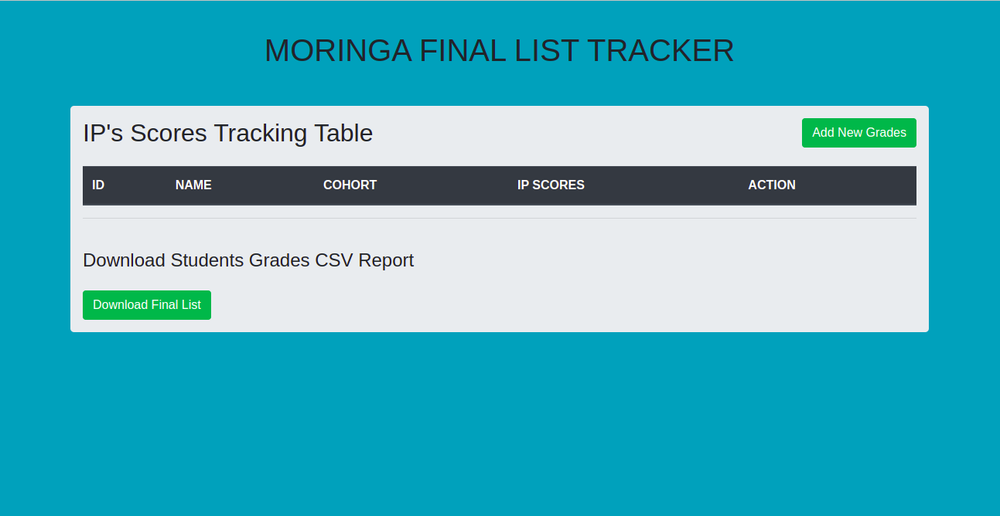
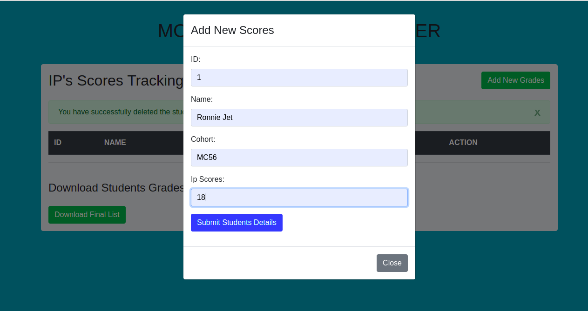

# Moringa Final List Tracker

> This is CRUD application created Using Flask Programming language to help users understand how to manipulate data from Python external files using external libraries. 

# App screenshot


## Installation

How to install Moringa Final List Tracker 

### Clone this repository
```bash
 git clone https://github.com/Roseoketch/Moringa-Final-List
```
* Move into the cloned directory:
```bash
cd Moringa-Final-List
```
* Create and activate your virtual environment:
```bash
python3 manage.py -m venv virtual
```
* Install project dependancies within your active environment: (Read: requirements.txt and use command below)
```bash
(virtual)$ pip3 Install -r requirements.txt
```

* Start the flask server
```bash
(virtual)$ python3 manage.py server
```


## Features and BDD

- As Moringa Staff, you can read, add, update, delete students IP Scores.
- As a Moringa Staff, you can download the Final List in CSV format.
- As a Moringa Admin, you upload students information to the Database.

## CRUD Table Display
| Adding New Student  | Updating Data of Existing Student  | Deleting the Student |
| :------------ |:---------------:| -----:|
|   |  |  |


## Technology Used  

  
>**Framework:** Flask  
**Language** Python

### Developed with
> **Structure:**   
* Bootstrap4 
* Flask Templates
* HTML

## Author
> Rose Oketch.

### LICENSE
[MIT](LICENSE) License  

Copyright (c) 2022 Rose Oketch

